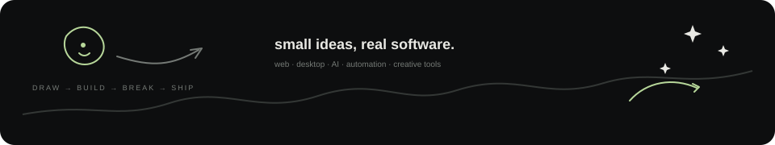
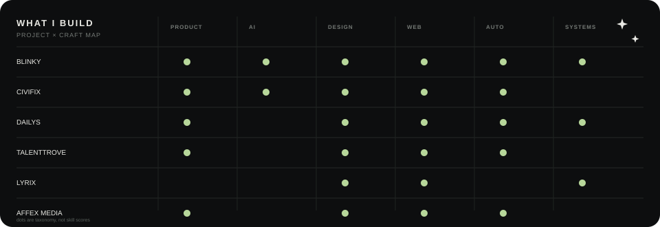
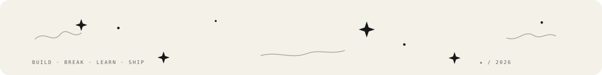

# VEDANT SHARMA

developer · designer · builder

### I build software at the intersection of **design, AI & automation.**

<a href="https://github.com/vedanthaha">github</a>
&nbsp;·&nbsp;
<a href="https://github.com/vedanthaha?tab=repositories">projects</a>
&nbsp;·&nbsp;
<a href="https://github.com/vedanthaha?tab=activity">activity</a>

 

  

## Selected work

| | project | focus |
|:--:|:--|:--|
| **01** | **[Blinky](https://github.com/vedanthaha/Blinky)** | desktop AI companion · screen awareness · voice · automation |
| **02** | **[CiviFix](https://github.com/vedanthaha/civifix)** | civic reporting · maps · routing · analytics |
| **03** | **[Dailys](https://github.com/vedanthaha/tracker)** | productivity · knowledge · graphs · outreach |
| **04** | **[TalentTrove](https://github.com/vedanthaha/talenttrove)** | recruitment product · interaction · visual systems |
| **05** | **[Lyrix](https://github.com/vedanthaha/lyrix)** | music · lyrics · creative tooling |
| **06** | **[Affex Media](https://github.com/vedanthaha/AffexMedia)** | digital / creative work |
| **07** | **[Gladiator Syndicate](https://github.com/vedanthaha/gladiator-syndicate)** | web / product experiment |
| **08** | **Giggll** | creative product experiment |

<strong>more experiments & repos</strong> · expand

A few more things I've explored across web, bots, automation, creative tooling and systems work.

- Telegram music / utility bots
- creative web experiments
- automation prototypes
- Linux / desktop experiments
- interaction and motion studies

 

  

## What I work with

Swiss-grid restraint · editorial hierarchy · one quiet accent

**PRODUCT**  
React · Next.js · TypeScript · Vite · Tailwind

**BACKEND / DATA**  
Node.js · Python · Supabase · PostgreSQL

**AI / AUTOMATION**  
LLMs · RAG · n8n · APIs · voice agents · computer control

**DESIGN / MOTION**  
Figma · UI/UX · motion · visual systems

**SYSTEMS**  
Linux · Git · Docker · Tauri

## Currently building

- AI-native software that feels like a product, not a demo
- desktop agents and computer-control workflows
- automation systems that remove repetitive work
- interfaces where motion supports the product instead of distracting from it

## Visuals

  

  <picture>
    <source media="(prefers-color-scheme: dark)" srcset="assets/github-snake-dark.svg">
    <source media="(prefers-color-scheme: light)" srcset="assets/github-snake.svg">
    
  </picture>

## Outside the terminal

basketball · making beats · design · motion · reading

  

`build → break → learn → ship`

★ made with too many tabs open

