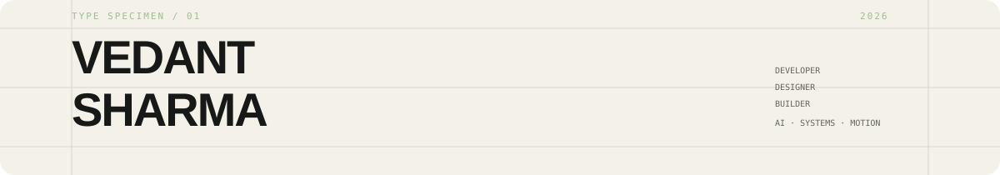
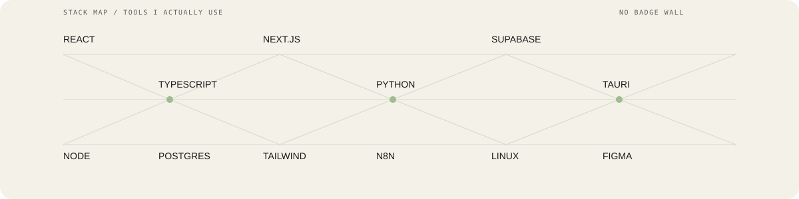
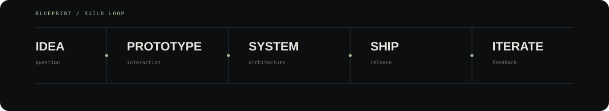

<picture>
  <source media="(prefers-color-scheme: dark)" srcset="https://readme-typing-svg.demolab.com?font=JetBrains+Mono&size=18&duration=2800&pause=900&color=B7D79A&center=true&vCenter=true&width=700&lines=developer+%C2%B7+designer+%C2%B7+builder;AI+%C2%B7+systems+%C2%B7+automation;making+software+feel+like+products">
  <source media="(prefers-color-scheme: light)" srcset="https://readme-typing-svg.demolab.com?font=JetBrains+Mono&size=18&duration=2800&pause=900&color=2DA44E&center=true&vCenter=true&width=700&lines=developer+%C2%B7+designer+%C2%B7+builder;AI+%C2%B7+systems+%C2%B7+automation;making+software+feel+like+products">
  
</picture>

# VEDANT SHARMA

I build software at the intersection of **design, AI & automation.**

<a href="https://github.com/vedanthaha">github</a>
&nbsp;·&nbsp;
<a href="https://github.com/vedanthaha?tab=repositories">projects</a>
&nbsp;·&nbsp;
<a href="https://github.com/vedanthaha?tab=activity">activity</a>

 

  

  

## Selected work

| # | project | what it is |
|:--:|:--|:--|
| 01 | **[Blinky](https://github.com/vedanthaha/Blinky)** | desktop AI companion · screen awareness · voice · automation |
| 02 | **[CiviFix](https://github.com/vedanthaha/civifix)** | civic reporting · maps · routing · analytics |
| 03 | **[Dailys](https://github.com/vedanthaha/tracker)** | productivity · knowledge · graphs · outreach |
| 04 | **[TalentTrove](https://github.com/vedanthaha/talenttrove)** | recruitment product · interaction · visual systems |
| 05 | **[Lyrix](https://github.com/vedanthaha/lyrix)** | music · lyrics · creative tooling |
| 06 | **[Affex Media](https://github.com/vedanthaha/AffexMedia)** | digital / creative work |
| 07 | **[Gladiator Syndicate](https://github.com/vedanthaha/gladiator-syndicate)** | web / product experiment |
| 08 | Giggll | creative product experiment |

<strong>more experiments & repos</strong> · expand

Telegram bots · automation prototypes · Linux experiments · desktop tooling · interaction studies · motion experiments · weird little web things

  

## Stack

  

**PRODUCT** · React · Next.js · TypeScript · Vite · Tailwind  
**BACKEND** · Node.js · Python · Supabase · PostgreSQL  
**AI / AUTOMATION** · LLMs · RAG · n8n · APIs · voice agents · computer control  
**DESIGN / MOTION** · Figma · UI/UX · motion · visual systems  
**SYSTEMS** · Linux · Git · Docker · Tauri

## Build loop

  

## GitHub / live data

<table>
<tr>
<td width="50%">

  

</td>
<td width="50%">

  

</td>
</tr>
</table>

  

## Contribution graph

  

## Snake

  <picture>
    <source media="(prefers-color-scheme: dark)" srcset="https://raw.githubusercontent.com/vedanthaha/vedanthaha/output/github-snake-dark.svg">
    <source media="(prefers-color-scheme: light)" srcset="https://raw.githubusercontent.com/vedanthaha/vedanthaha/output/github-snake.svg">
    
  </picture>

## Outside the terminal

basketball · making beats · design · motion · reading

  

`build → break → learn → ship`

★ made with too many tabs open

